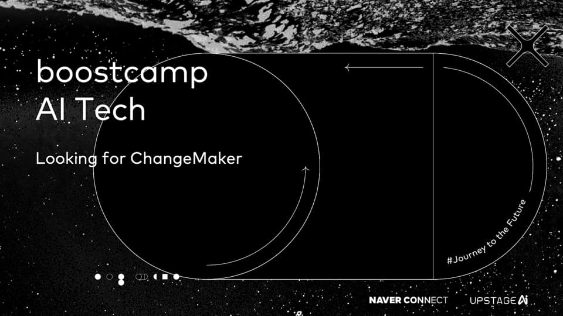

# Deep Learning Basics
--- 

- 본 레포는 [부스트캠프 AI Tech](https://boostcamp.connect.or.kr) U Stage **Deep Learning Basics** 파트에 사용할 실습 자료 입니다!

## Code List

- 신경망(neural network) 
    - [MLP](https://github.com/jjerry-k/tc_practice/blob/main/01_MLP.ipynb)

- 최적화(Optimization)
    - [MLP](https://github.com/jjerry-k/tc_practice/blob/main/02_Optimizer.ipynb)

- CNN(Convolutional Neural Network)
    - [CNN](https://github.com/jjerry-k/tc_practice/blob/main/03_CNN.ipynb)
    - [CNN 1x1 conv](https://github.com/jjerry-k/tc_practice/blob/main/03_CNN_using_1x1.ipynb)
    - [Advanced CNN](https://github.com/jjerry-k/tc_practice/blob/main/03_MCNN_Advanced.ipynb)

- Sequential Model: RNN, LSTM, GRU
    - [RNN](https://github.com/jjerry-k/tc_practice/blob/main/04_RNN.ipynb)
    - [LSTM](https://github.com/jjerry-k/tc_practice/blob/main/04_LSTM.ipynb)
    - [GRU](https://github.com/jjerry-k/tc_practice/blob/main/04_GRU.ipynb)

- Attention Model
    - [MHA](https://github.com/jjerry-k/tc_practice/blob/main/05_MHA.ipynb)

- Generative Model
    - [VAE](https://github.com/jjerry-k/tc_practice/blob/main/06_VAE.ipynb)
    - [GAN](https://github.com/jjerry-k/tc_practice/blob/main/06_GAN.ipynb)
    - [DCGAN](https://github.com/jjerry-k/tc_practice/blob/main/06_DCGAN.ipynb)
